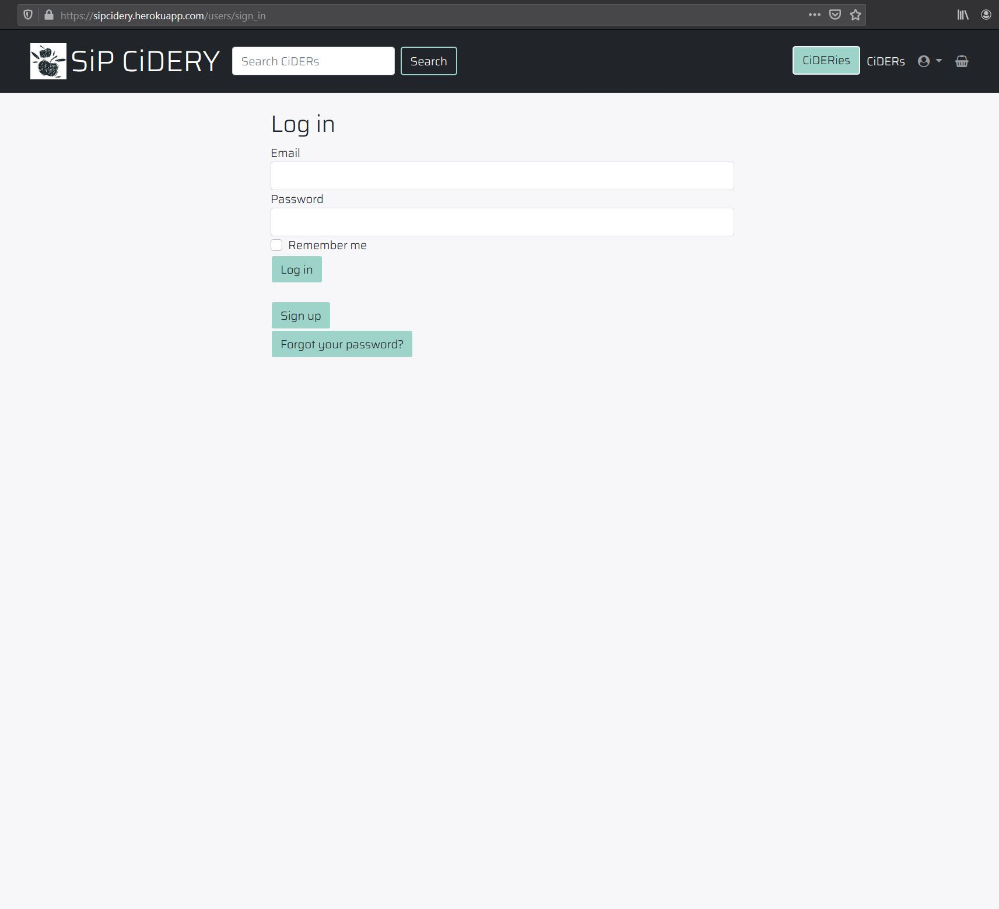

# 🍏🍺 SiP CiDERY

url: https://sipcidery.herokuapp.com/<br>
GitHub: https://github.com/irahrosete/sipcidery

This app aims to connect cider drinkers and local cideries in Australia. The cider industry currently only makes up 4% of the alcohol market in Australia.<sup>1</sup> This is tiny in comparison to beer or wine. This may be due to a matter of taste preference, but it could also be due to lack of awareness of the many different styles and makers of ciders out there.

In the last five years, drinkers have evolved to wanting more sophisticated flavours, and as a result, the cider industry has responded with great product innovation leading to increase in their ranges as well as promotional activities. However, smaller cideries still have less online presence and less likely to supply major national liquor retailers.<sup>2</sup>

**SiP CiDERY** aims to create awareness for drinkers as well as provide an additional avenue for cideries to showcase their products, and in the process boost sales for cideries as well as the local apple and pear growers that they rely on.

__<br>
<em><sup>1</sup> Cider Australia. 2021. Industry. [online] Available at: <http://www.cideraustralia.org.au/industry/> [Accessed 27 February 2021].<br>
<sup>2</sup> IBISWorld. 2021. Cider Production in Australia. [online] Available at: <https://www.ibisworld.com/au/industry/cider-production/4021/> [Accessed 27 February 2021].</em>

## Purpose
To provide an online platform for local cideries to showcase their products, and for new and avid cider drinkers to discover ciders online.

## Features
- There is a common landing page for all users.
- Users can browse all the ciders and cideries available even when not logged in.
- User authentication and authorisation are implemented.
- Users are classified into admins, reps, normal users and guests (unregistered users).
- When a user registers, they are defaulted as a normal user.
- Normal users are able to save/unsave drinks, and access saved drinks in their profile.
- Admins have access to the entire app functionality, apart from the save/unsave drinks feature as this does not create any value to admins.
- Only admins can onboard and delete cideries. This is so that all cideries in the app are legitimate.
- Reps are user representatives of cideries. Cideries have at least one rep.
- Admins assign a normal user with the role of rep and link them to their corresponding cidery to ensure that only legitimate representatives get access to their cidery page. This feature is done through the Rails framework, Administrate, which requires the admin to input a unique password reset token to complete this assignment.
- Reps are able to add, update and delete drinks available to their cidery only. They can also edit their own cidery profile.
- Logged in users can see their name in the navbar, and reps can additionally see their cidery name in the navbar which links to their cidery page.
- The app has a 'discover a cider' functionality that presents randomised drink to the user whether they're logged in or not. This reinforces the app's purpose of the creating awareness and encouraging the users to try new ciders.
- Drinks can be searched from the search bar using drink names.
- Drinks are also able to be accessed according to cidery.

## Target Audience
1. Experimental and avid cider drinkers of at least the age of 18
2. Local cideries

## User Stories
*As a* user<br>
*I want to* be able to sign up and sign in<br>
*So that* I can access the app.<br>

*As a* user<br>
*I want to* be able to sign out<br>
*So that* I can end my session and no one else can access my account.<br>

*As a* user<br>
*I want to* be able to search for ciders<br>
*So that* I know what are available.<br>

*As a* user<br>
*I want to* be able to update my profile page<br>
*So that* I can keep it up to date.<br>

As a user<br>
I want to be able to see my name in the navbar<br>
So I can be reminded if I'm logged in or not.<br>

As a cidery<br>
I want to be able to log in and access my drinks list<br>
So that I can add new drinks and update availability.<br>

As a cider drinker<br>
I want to be able to access the drinks list<br>
So that I can browse drinks by cidery and search from the navbar.<br>

As a cider drinker<br>
I want to be able to save drinks I find interesting<br>
So that I can easily come back to them.<br>

As an administrator<br>
I want to be able to log in to have access to the whole app<br>
So that I can maintain the site and assist other users.<br>

As an administrator<br>
I want to be able to manage users<br>
So that I can assign roles and cidery to representatives.<br>

## Sitemap


## Wireframes


## User Interface



## Tech Stack
           
 

## Components
The app is built on Ruby on Rails, and as such inherits a Model-View-Controller structure. All of the pages the user sees on the screen are rendered by the View using HTML with ERB (Embedded Ruby). This combination makes a static page dynamically rendered. This is evident, for instance, when bringing up all the available Cideries or all the available Ciders or all the saved Ciders by a particular user. ERB, through the Ruby language, makes it possible to iterate through a list and reveal the whole list without manually encoding the list as HTML only.

The View also utilises partial files in order to eliminate repetition of the code. The Navbar is a partial file that the app uses and is rendered on every page even without encoding it on every single page. The form is another partial file which is called from within another html.erb file whenever a new cider or cidery or user is created or edited.

The app knows which page to go to when a user clicks on a link because these instructions are set up in the Routes, which the Controller relies on.

The Controller is responsible for getting and sending instructions between the View and the Model. It performs minimal processing in the app like searching through or randomising a list, or not allowing a user who's not logged in to access some pages they are not meant to. If there is a more complex processing that needs to be done, this is taken care of by the Model.

The Model represents the structure of data in the app. The app has a model for cideries, for example, and another for ciders and another for users. These different models talk to each other according to the relationships that have been set up between them. The actual entries of data that users of the app save or access are stored in the database, which in this case is PostgreSQL.

## Entity Relationship Diagram


## Database Relations
The main databases of the application are the `drinks`, the `cideries` and the `users`.

The `drinks` database has one-to-many relationship with the `cideries` database. Each drink must be linked to a cidery, otherwise it won't exist. And a cidery can have many or no drinks.

The `drinks` database is linked to three other databases: the `styles` database, the `sugar_content` database, and the `prod_methods` database; and has a one-to-many relationship with each of them. A drink cannot exist if it has no style, sugar_content or prod_method attribute.

A drink, therefore, has four foreign keys, which if one does not exist then a drink record will not be created.

Users are categorised into three according to their role: a super user, a normal user, or a rep user. A rep user is a representative of a cidery. The `users` database is linked to the `cideries` database only when the user is a rep user. A rep user can be linked to only one cidery and a cidery must have at least one rep. A user other than a rep user does not have to be linked to a cidery.

The `cideries` and `drinks` database both contain an image attribute whichis handled by Rails Active Storage.

There are also two joint tables in the app:

- The `saved_drinks` database stores all the drinks saved by a normal user. There is a many-to-many-relationship between users and drinks through the `saved_drinks` database. A user can have many or no saved drinks, and a drink can be saved by many or no user.
- The other joint table is the `availables` table, which stores all the drinks that are available through a particular retailer. Drinks have a many-to-many relationship with retailers through this table. A retailer can have many or no drinks, and a drink can have many or no retailers.

## Model Associations
The `Drink` model belongs to `Cidery`, `Style`, `SugarContent`, and `ProdMethod` models. A drink record cannot be created if any one of the four attributes are not assigned. And each of these four models has a has_many relationship with Drinks.

The `Cidery` and `User` models are linked for all users belonging to the role `rep`, which is defined as an enumerator in the `User` model. `Cidery` is made optional for users in order to implement this.

Both the `Cidery` and the `Drink` models have an image attribute and this is handled by Rails Active Storage through the has_one_attach relationship defined in both models.

The `SavedDrink` model links `Drink` and `User` models and have a has_many :through relationship so that a user can save many drinks, and a drink can be saved by many users. This model makes the save function of the app possible.

The `Available` model is there to link `Drink` and `Retailer` models. This is another has_many :through relationship that allows an entry to be stored to the database when a drink is available from a certain retailer. A retailer can hold many drinks and a drink can be availble through many retailers.

## Schema
```ruby
ActiveRecord::Schema.define(version: 2021_03_20_024801) do
  enable_extension "plpgsql"

  create_table "active_storage_attachments", force: :cascade do |t|
    t.string "name", null: false
    t.string "record_type", null: false
    t.bigint "record_id", null: false
    t.bigint "blob_id", null: false
    t.datetime "created_at", null: false
    t.index ["blob_id"], name: "index_active_storage_attachments_on_blob_id"
    t.index ["record_type", "record_id", "name", "blob_id"], name: "index_active_storage_attachments_uniqueness", unique: true
  end

  create_table "active_storage_blobs", force: :cascade do |t|
    t.string "key", null: false
    t.string "filename", null: false
    t.string "content_type"
    t.text "metadata"
    t.string "service_name", null: false
    t.bigint "byte_size", null: false
    t.string "checksum", null: false
    t.datetime "created_at", null: false
    t.index ["key"], name: "index_active_storage_blobs_on_key", unique: true
  end

  create_table "active_storage_variant_records", force: :cascade do |t|
    t.bigint "blob_id", null: false
    t.string "variation_digest", null: false
    t.index ["blob_id", "variation_digest"], name: "index_active_storage_variant_records_uniqueness", unique: true
  end

  create_table "availables", force: :cascade do |t|
    t.bigint "drink_id"
    t.bigint "retailer_id"
    t.datetime "created_at", precision: 6, null: false
    t.datetime "updated_at", precision: 6, null: false
    t.index ["drink_id"], name: "index_availables_on_drink_id"
    t.index ["retailer_id"], name: "index_availables_on_retailer_id"
  end

  create_table "cideries", force: :cascade do |t|
    t.string "name"
    t.text "description"
    t.string "email"
    t.datetime "created_at", precision: 6, null: false
    t.datetime "updated_at", precision: 6, null: false
    t.string "origin"
  end

  create_table "drinks", force: :cascade do |t|
    t.string "name"
    t.text "description"
    t.datetime "created_at", precision: 6, null: false
    t.datetime "updated_at", precision: 6, null: false
    t.bigint "cidery_id", null: false
    t.bigint "style_id", null: false
    t.bigint "sugar_content_id", null: false
    t.bigint "prod_method_id", null: false
    t.float "abv"
    t.integer "size"
    t.index ["cidery_id"], name: "index_drinks_on_cidery_id"
    t.index ["prod_method_id"], name: "index_drinks_on_prod_method_id"
    t.index ["style_id"], name: "index_drinks_on_style_id"
    t.index ["sugar_content_id"], name: "index_drinks_on_sugar_content_id"
  end

  create_table "prod_methods", force: :cascade do |t|
    t.string "name"
    t.text "description"
    t.datetime "created_at", precision: 6, null: false
    t.datetime "updated_at", precision: 6, null: false
  end

  create_table "retailers", force: :cascade do |t|
    t.string "name"
    t.datetime "created_at", precision: 6, null: false
    t.datetime "updated_at", precision: 6, null: false
  end

  create_table "saved_drinks", force: :cascade do |t|
    t.bigint "drink_id", null: false
    t.bigint "user_id", null: false
    t.datetime "created_at", precision: 6, null: false
    t.datetime "updated_at", precision: 6, null: false
    t.index ["drink_id"], name: "index_saved_drinks_on_drink_id"
    t.index ["user_id"], name: "index_saved_drinks_on_user_id"
  end

  create_table "styles", force: :cascade do |t|
    t.string "name"
    t.text "description"
    t.datetime "created_at", precision: 6, null: false
    t.datetime "updated_at", precision: 6, null: false
  end

  create_table "sugar_contents", force: :cascade do |t|
    t.string "name"
    t.text "description"
    t.datetime "created_at", precision: 6, null: false
    t.datetime "updated_at", precision: 6, null: false
  end

  create_table "users", force: :cascade do |t|
    t.string "email", default: "", null: false
    t.string "encrypted_password", default: "", null: false
    t.string "reset_password_token"
    t.datetime "reset_password_sent_at"
    t.datetime "remember_created_at"
    t.datetime "created_at", precision: 6, null: false
    t.datetime "updated_at", precision: 6, null: false
    t.string "first_name"
    t.string "last_name"
    t.integer "role", default: 0
    t.bigint "cidery_id"
    t.index ["cidery_id"], name: "index_users_on_cidery_id"
    t.index ["email"], name: "index_users_on_email", unique: true
    t.index ["reset_password_token"], name: "index_users_on_reset_password_token", unique: true
  end

  add_foreign_key "active_storage_attachments", "active_storage_blobs", column: "blob_id"
  add_foreign_key "active_storage_variant_records", "active_storage_blobs", column: "blob_id"
  add_foreign_key "availables", "drinks"
  add_foreign_key "availables", "retailers"
  add_foreign_key "drinks", "cideries"
  add_foreign_key "drinks", "prod_methods"
  add_foreign_key "drinks", "styles"
  add_foreign_key "drinks", "sugar_contents"
  add_foreign_key "saved_drinks", "drinks"
  add_foreign_key "saved_drinks", "users"
  add_foreign_key "users", "cideries"
end
```

The `active_storage` tables were generated by installing Active Storage to allow for images to be handled by the application. The `users` table was created with the installation of the gem Devise. This installation also made the email attribute a unique field.

One of the first tables created was the `drinks` table through the generation of a model. Attributes have later on been added to and deleted from the model using migrations, and references to other tables such as the `cideries`, `styles`, `sugar_contents` and `prod_methods` tables have also been done through migrations. The foreign keys that relate to these are listed at the bottom of the schema.

Creation of most tables is through a model generation. Tables like `availables` and `saved_drinks` are two of the last ones created to serve as a joint table, which only contain foreign keys.

The schema shows what type of data are handled by each attributes within the tables, which could either be string or integer or float or bigint in the case of foreign keys. Most of the foreign keys have a null:false attribute except for the cidery_id in the `users` table which only applies to a user with rep user role.

## Thrid-party Services
- **Bootstrap** is an open-source CSS framework that allows for responsive design. This was used for styling the views in addition to custom SCSS. The dropdown function in the navbar and the navbar itself are main examples of ho Bootstrap styles were applied.
- **AWS S3** is a simple storage service provided by Amazon Web Services to store images attached to the app in the cloud. The cidery logos and the cider photos are all stored in the cloud through AWS S3.
- **Heroku** is a Platform as a Service that allows Ruby on Rails applications to be managed and deployed in the cloud.
- **PostgreSQL** is an open-source relational database management system. The database of the app uses postgreSQL at development stage and Heroku uses PostgreSQL to deploy the app.
- **Devise** is a user authentication library for Rails. This was used in the app to allow for user registration, log in, log out.
- **CanCanCan** is a user athorisation library for Rails. This was used to implement the different access levels of the three roles defined in the app: normal user, rep user and super user.
- **Administrate** is a Rails framework for creating an admin dashboard linked to the app. This was used to allow the super user to be able to manage users, primarily to make a normal user a rep user and assign the correct cidery to them.
- **Simple Form** is a Rails framework for creating flexible forms. This was used in the app for adding and editing ciders and cideries.
- **Font Awesome Rails** is another Rails framework to access the Font Awesome web library. This is evidenced by the profile icon in the navbar.

## Design and Planning
[Trello](https://trello.com/b/uXRYgups/sip-cidery) was used to manage the project. Initial user stories were setup and tasks relating to these user stories were created and moved along the board as they get actioned, tested and completed. Each task was assigned a size and flagged as whether or not it is a core requirement or an extra feature. Core requirements were prioritised. Adjustments and reassessments were done periodically to make sure that requirements are being met given the deadline. Each task was broken down further to smaller tasks and was assigned a completion date to make it easier to know what order they need to be started during the development timeframe.


## Workflow, Testing and Deployment
This app was developed in the Windows environment using Windows Subsystem for Linux (WSL). Majority of the testing was done manually using test user accounts.

The app was deployed to Heroku early in the development stage and continuous deployment was implemented. The code was tested locally on the Windows OS, and then tested again after deployment.

## Improvements
- **Age gate**. A page or pop up window that would ask the user to confirm that they are within the legal drinking age, othersiwe they are not allowed into the site.
- **Autocomplete**. Use the [Address Finder API](https://addressfinder.com.au/api/au/location/autocomplete/) for the Cidery origin attribute that will autcomplete with suburb, state and postcode from the form.
- **Online transaction**. The ability for users to buy directly from the cideries.
- **User invitation**. Allow new or existing users to be assigned representative role using an invitation token sent as email by existing representatives.
- **User confirmation**. Users can only register once confirming validity of their email.

## Setup
When installing this application locally, make sure you have Ruby installed. Run `ruby -v` from your terminal to check if you have Ruby already installed. If not, follow this [Ruby installation guide](https://www.ruby-lang.org/en/documentation/installation/) on how to install Ruby on your operating system.

Next, make sure Rails and Bundler are installed. To check if they are, run `rails -v` and `bundler -v`. If not, run the following in your terminal:<br>
`gem install rails`<br>
`gem install bundler`

Also make sure that PostgreSQL is installed and running. If not, follow these instructions for [PostgreSQL installation](http://postgresguide.com/setup/install.html). Run `psql` to check that everything installed correctly. For Windows, you may need to run `sudo service postgresql start` from your terminal to run PostgreSQL.

Finally, follow the below instructions from your terminal:
1. Clone this github repo.<br>
`git@github.com:irahrosete/sipcidery.git`
2. Navigate to the sipcidery folder.<br>
`cd sipcidery`
3. Run the following commands:<br>
`bundle install`<br>
`yarn install --check-files`<br>
`rails db:migrate`<br>
`rails db:seed`
4. Start up the Rails server.<br>
`rails s`
5. Bring up the app from your browser.<br>
`http://localhost:3000/`